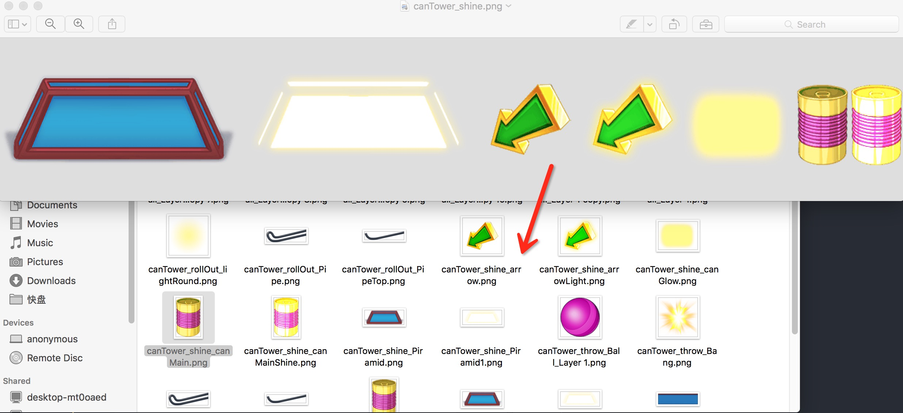
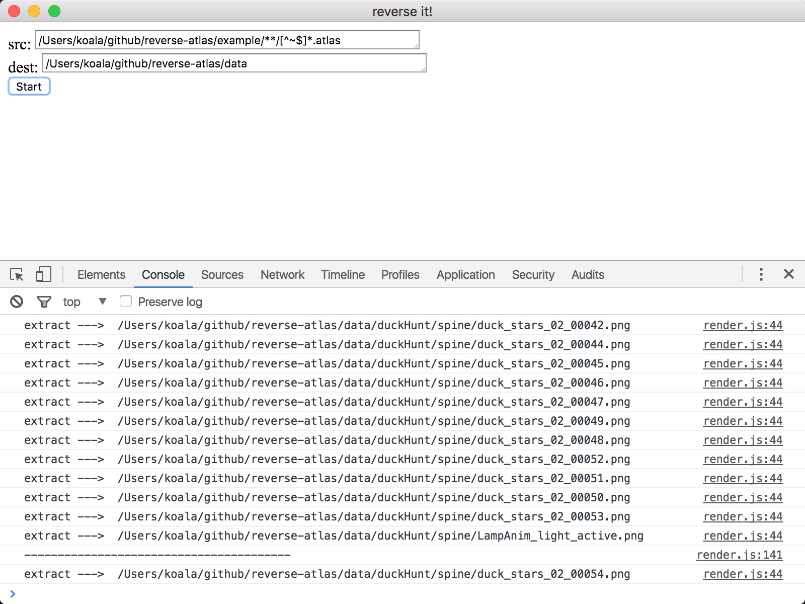

atlas-parser
============

write in a hurry ,sorry for the shit code.

### Intro
* Based on [NodeJS](https://nodejs.org/) and [Electron](http://electron.atom.io/).
* crop image by pure javascript.

### Screenshot


### For what use?
1. Parse `spine(h5 animation editor)` atlas([libgdx atlas format](http://esotericsoftware.com/spine-atlas-format)) to JSON format.

2. Cut spine atlas to slices by `.atlas`&`.png` files.

3. Crop image with `x,y,width,height` in batch.

### Usage
To clone and run this repository you'll need [Git](https://git-scm.com) and [Node.js](https://nodejs.org/en/download/) (which comes with [npm](http://npmjs.com)) installed on your computer. From your command line:

```bash
# Clone this repository
git clone https://github.com/koalaylj/reverse-atlas
# Go into the repository
cd reverse-atlas
# Install dependencies and run the app
npm install && npm start
```

### Quick start

* Fill the `src` folder and `dest` fold then click `start` button.
* `src` must be `glob` path style.

  example:`/your/path/example/**/[^~$]*.atlas`


### How
`new Image()` --> `canvas.drawImage(image,x,y,w,h)` --> `canvas.toDataUrl()` --> save it with `base64` code.

At last
=====
mac & pc portable package on the air.
有问题可以QQ群内讨论:223460081

MIT License
